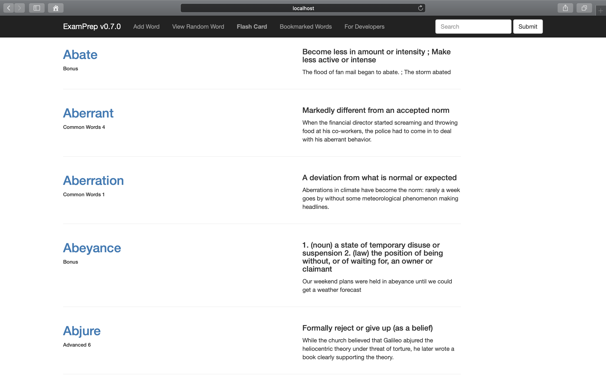
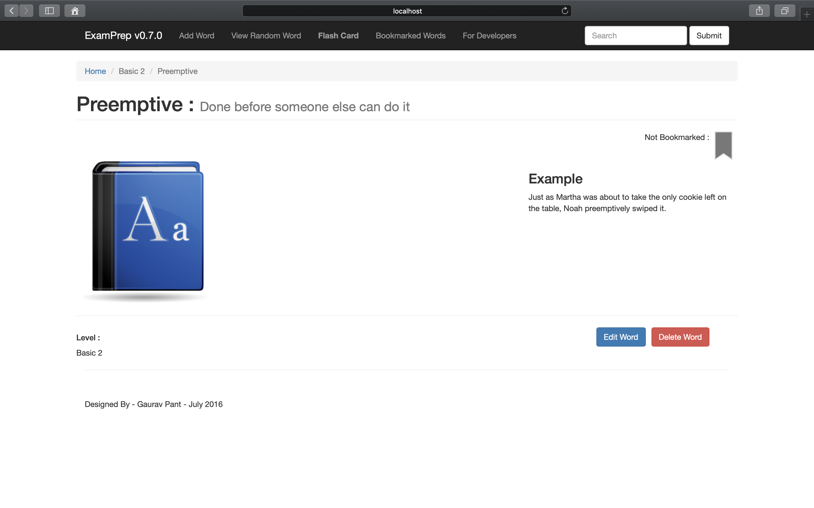
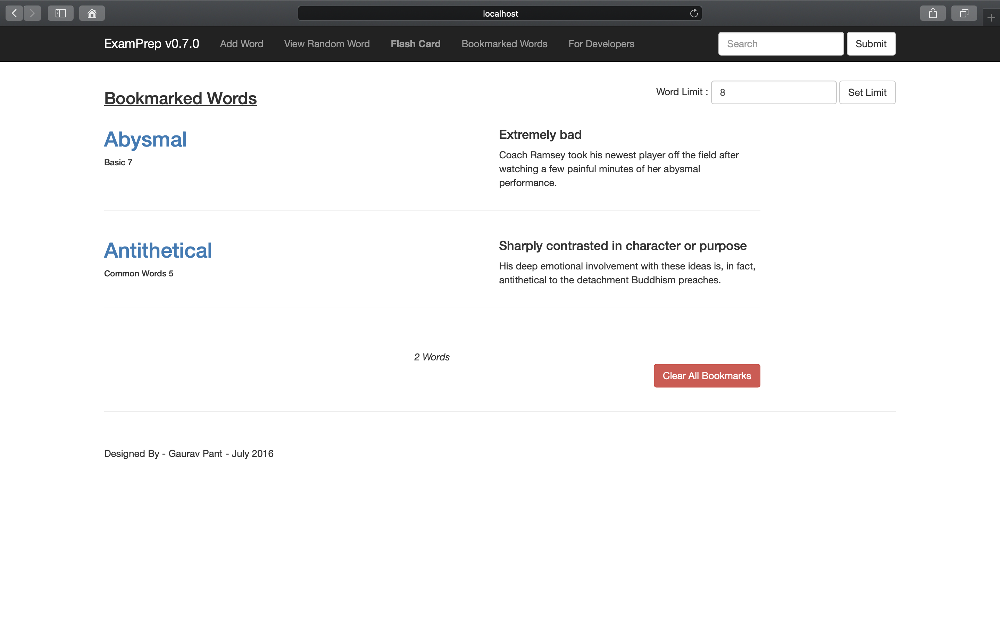
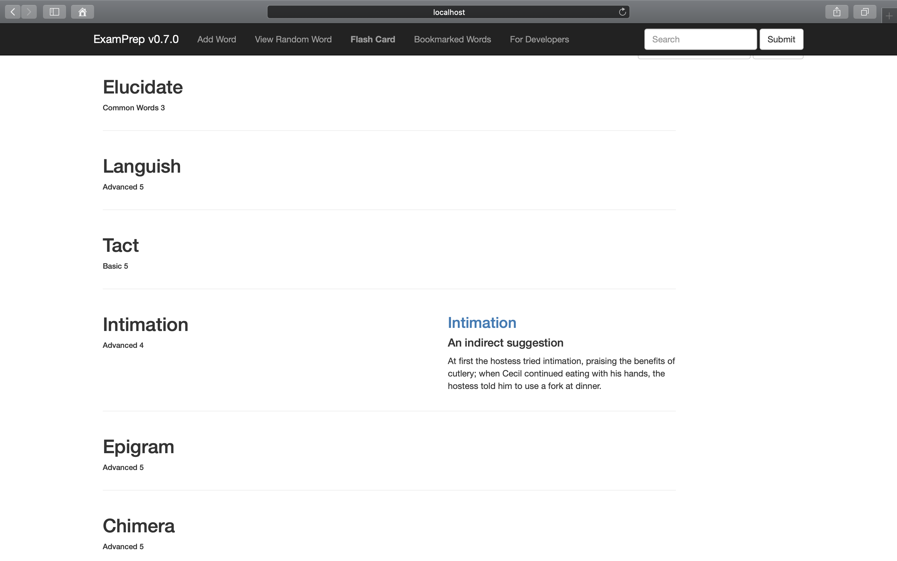

# ExamPrep
ExamPrep is a vocabulary builder tool to prepare for various examinations.

---

## Installation -
1. Download & Unzip the project [https://codeload.github.com/gauravpgaurav/ExamPrep/zip/master]
2. Download & Install node.js [https://nodejs.org/en/download/]
3. Download & Install mongoDb [https://www.mongodb.com/download-center?jmp=nav#community]
4. Open the root folder of the application in cmd/terminal and type -

    **npm install**

5. Run mongoDb (mongod) in cmd/terminal.
7. Go to data folder in cmd/terminal and type -

      **mongoimport --db exam --collection words --file words.json**

   This will load the database into your local mongoDb server.
7. To make search work. Text indexes must be created. Open mongo, switch to exam database & type -

	**db.words.createIndex(
   {
     	"level": "text",
     	"meaning": "text",
	"word": "text"
   }
 );**

8. To export data (while mongoDb server is runnning)-

    **mongoexport --db exam --collection words --out words.json**

   This will duplicate your local database to the current directory.
---

## Usage -
1. Run mongoDb (mongod) in cmd/terminal.
2. Open the root folder of the application in cmd/terminal and type -

     **node app.js**
3. Open [http://localhost:3000/] in browser.

---

## Special Features -
1. Bookmark words : Revisit these words whenever you want.

2. Flashcard mode : Quiz yourself on these words
   - Users can also run flashcard mode on bookmarked words

---